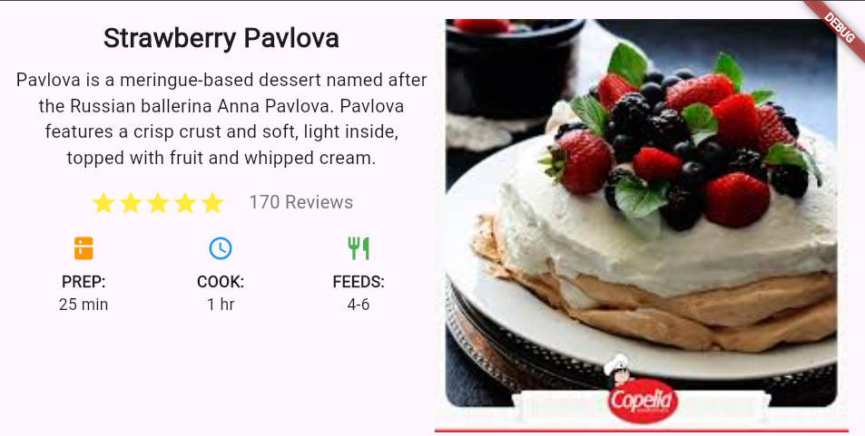

 s9_ejercicio_03

Este es un proyecto de Flutter que muestra una tarjeta de receta para **Strawberry Pavlova**. La aplicación destaca la preparación de un postre a base de merengue, presentando información clave como el tiempo de preparación, cocción y número de porciones.

## Características

- Interfaz de usuario atractiva y moderna.
- Descripción detallada del postre.
- Calificaciones y reseñas de los usuarios.
- Información útil sobre el tiempo de preparación, cocción y cantidad de porciones.

## Getting Started

Este proyecto es un punto de partida para una aplicación Flutter.

Si es tu primer proyecto de Flutter, aquí hay algunos recursos para ayudarte a comenzar:

- [Lab: Escribe tu primera aplicación Flutter](https://docs.flutter.dev/get-started/codelab)
- [Cookbook: Ejemplos útiles de Flutter](https://docs.flutter.dev/cookbook)

Para obtener ayuda para comenzar con el desarrollo de Flutter, consulta la
[documentación en línea](https://docs.flutter.dev/), que ofrece tutoriales, ejemplos, orientación sobre desarrollo móvil y una referencia completa de la API.

## Requisitos

- Flutter SDK
- Un editor de código como Visual Studio Code o Android Studio

## Instalación

1. Clona este repositorio en tu máquina local:
   ```bash
   git clone https://github.com/german654/s9_ejercicio_03.git
   ```
2. Navega a la carpeta del proyecto:
   ```bash
    cd s9_ejercicio_03
   ```

3. Instala las dependencias:
    ```bash
    flutter pub get
    ```
4. Ejecuta la aplicación:
bash
    ```bash
    flutter run
    ```
## Estructura del proyecto

lib/main.dart: El punto de entrada de la aplicación y donde se define la interfaz de usuario.

## Contribución
Este es un proyecto de ejercicio simple, pero si tienes sugerencias de mejora, no dudes en abrir un issue o enviar un pull request.

## Licencia
Este proyecto es de código abierto y está disponible bajo la Licencia MIT.
